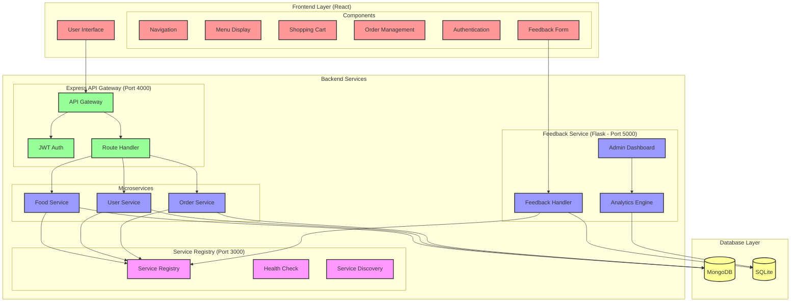

## Food Delivery Management System

```mermaid
graph TB
    subgraph "Frontend Layer (React)"
        UI[User Interface]
        subgraph "Components"
            NAV[Navigation]
            MENU[Menu Display]
            CART[Shopping Cart]
            ORDER[Order Management]
            AUTH[Authentication]
            FEED[Feedback Form]
        end
    end

    subgraph "Backend Services"
        subgraph "Express API Gateway (Port 4000)"
            API[API Gateway]
            JWT[JWT Auth]
            ROUTES[Route Handler]
        end

        subgraph "Microservices"
            FOOD[Food Service]
            USER[User Service]
            ORDER_MS[Order Service]
        end

        subgraph "Service Registry (Port 3000)"
            SR[Service Registry]
            HD[Health Check]
            DISC[Service Discovery]
        end

        subgraph "Feedback Service (Flask - Port 5000)"
            FB[Feedback Handler]
            ADMIN[Admin Dashboard]
            ANALYTICS[Analytics Engine]
        end
    end

    subgraph "Database Layer"
        MONGO[(MongoDB)]
        SQLITE[(SQLite)]
    end

    %% Frontend to Backend Connections
    UI --> API
    FEED --> FB

    %% API Gateway Connections
    API --> JWT
    API --> ROUTES
    ROUTES --> FOOD
    ROUTES --> USER
    ROUTES --> ORDER_MS

    %% Service Registry Connections
    FOOD --> SR
    USER --> SR
    ORDER_MS --> SR
    FB --> SR

    %% Database Connections
    FOOD --> MONGO
    USER --> MONGO
    ORDER_MS --> MONGO
    FB --> SQLITE

    %% Admin Connections
    ADMIN --> ANALYTICS
    ANALYTICS --> SQLITE

    classDef frontend fill:#ff9999,stroke:#333,stroke-width:2px
    classDef gateway fill:#99ff99,stroke:#333,stroke-width:2px
    classDef service fill:#9999ff,stroke:#333,stroke-width:2px
    classDef database fill:#ffff99,stroke:#333,stroke-width:2px
    classDef registry fill:#ff99ff,stroke:#333,stroke-width:2px

    class UI,NAV,MENU,CART,ORDER,AUTH,FEED frontend
    class API,JWT,ROUTES gateway
    class FOOD,USER,ORDER_MS,FB,ADMIN,ANALYTICS service
    class MONGO,SQLITE database
    class SR,HD,DISC registry
```
